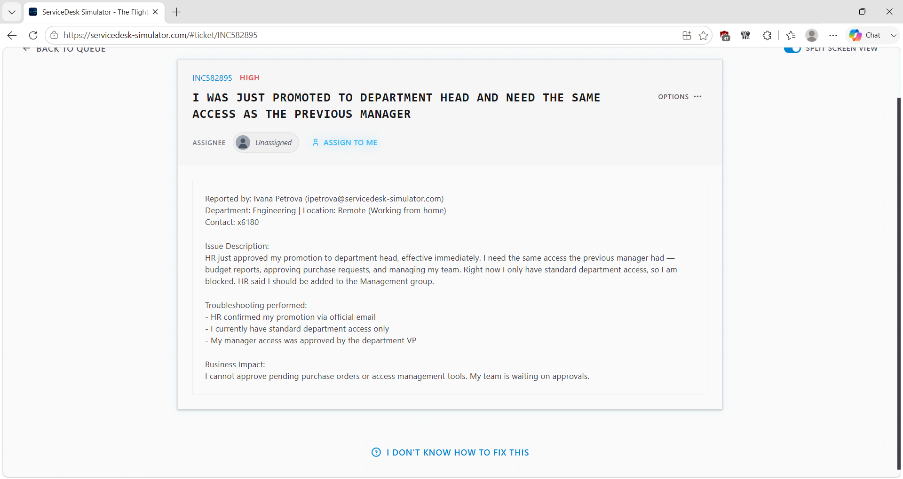
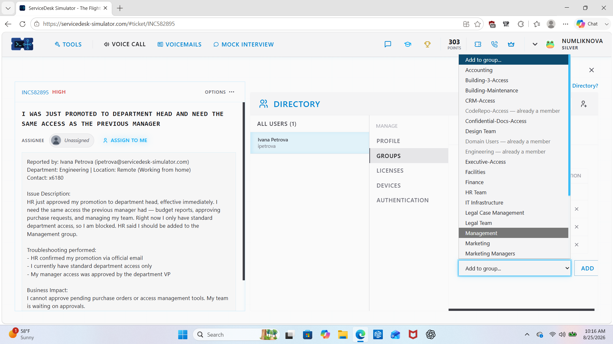
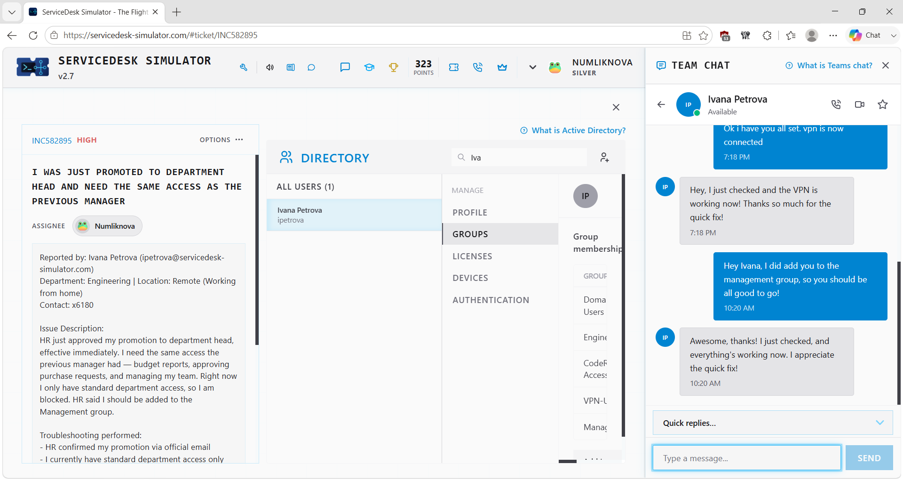
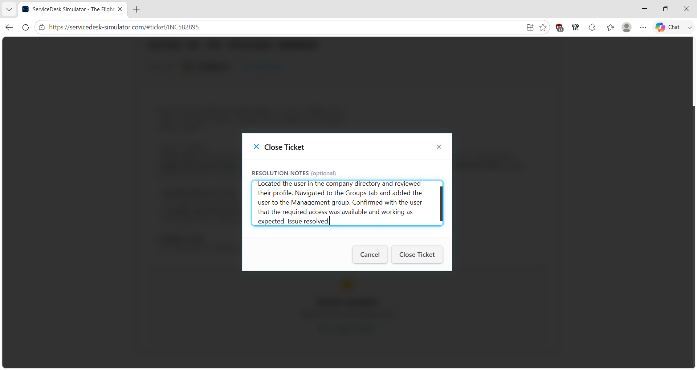

# Service Desk Simulation – Management Access After User Promotion

## Overview

This service desk simulation demonstrates how I handled an access-provisioning request for an employee who had been promoted to a department leadership role and required Management access.

Before changing the user's access, I reviewed the request and verified that the promotion and access change had the appropriate approval. I then located the correct user account, reviewed the user's group membership, added the user to the Management group, verified that the required access became available, and documented the completed change.

> **Note:** This scenario was completed in a service desk simulation for hands-on learning and does not represent professional production experience.

## Ticket Summary

- **Ticket:** User Promoted to Department Head – Management Access Required
- **Priority:** High
- **Category:** Identity & Access Management / Access Provisioning
- **Environment:** Service Desk Simulator
- **Status:** Resolved

## Scenario

An existing employee had been promoted into a department leadership position and required access associated with the new responsibilities.

Because this request involved modifying access to organizational resources, I did not immediately change the user's group membership.

I first reviewed the request and verified that the promotion and requested access change had been authorized.

This scenario represents a **Mover**-type identity lifecycle event because an existing employee's responsibilities changed and their access needed to be updated accordingly.

## Access Provisioning Process

### 1. Review the Request and Verify Authorization

I reviewed the ticket, business need, priority, and approval information before taking ownership of the request.

Because the change involved granting additional access, verifying authorization was an important step before modifying the user's account.

### 2. Locate and Verify the Correct User

I navigated to the employee directory and searched for the affected employee.

Before making any changes, I verified that I had selected the correct user account associated with the approved promotion request.

### 3. Update Group Membership

I opened the user's group membership information and added the employee to the **Management** group required for the new role.

This changed the user's assigned group membership to reflect the approved access requirement.

### 4. Verify Access With the User

After updating the group membership, I contacted the user and asked them to verify the newly required access.

The user confirmed that the appropriate Management access was now available.

### 5. Document the Resolution

After confirming that the access change worked as intended, I documented the completed actions and outcome in the service desk ticket.

## Resolution

The approved Management access request was completed by updating the user's group membership.

I verified the authorization before making the change, added the correct user to the Management group, confirmed with the user that the required access became available, and documented the completed request.

## Access Management Workflow

**Employee promoted**

→ Review requested access

→ Verify approval

→ Locate correct identity

→ Review group membership

→ Add approved Management group

→ Verify access with user

→ Document resolution

## Technical Concepts Practiced

### Access Provisioning

Access provisioning involves assigning the access a user requires to perform authorized job responsibilities.

In this scenario, the employee's responsibilities changed after a promotion, requiring an update to their existing access.

### Group-Based Access

Groups can be used to organize and manage access for users with similar responsibilities.

Instead of manually changing individual resources, the simulator used membership in the Management group as part of the access-provisioning workflow.

### Authorization Before Access Changes

A request for additional access should not automatically result in the access being granted.

This scenario reinforced the importance of confirming that the requested change has been appropriately authorized before modifying the user's account.

### Joiner-Mover-Leaver Concept

Identity access requirements can change throughout a user's relationship with an organization.

- **Joiner:** A new user receives appropriate initial access.
- **Mover:** An existing user's role or responsibilities change and their access is updated.
- **Leaver:** Access is removed when the user leaves the organization.

This ticket represents the **Mover** portion of that lifecycle.

### Least Privilege

Access should be based on the user's current responsibilities rather than granting unnecessarily broad permissions.

In this simulation, I applied the specific approved Management group membership associated with the access request rather than making unrelated access changes.

## Skills Demonstrated

- Service desk ticket ownership
- Identity and access support
- Access provisioning
- Group membership management
- Authorization verification
- User account administration
- Joiner-Mover-Leaver fundamentals
- Least-privilege concepts
- User communication
- Access verification
- Technical documentation

## Key Takeaway

This scenario reinforced that access management is not simply about knowing how to add someone to a group.

The authorization behind the change matters just as much as the technical action.

**Verify request → Verify identity → Modify approved access → Confirm result → Document**
