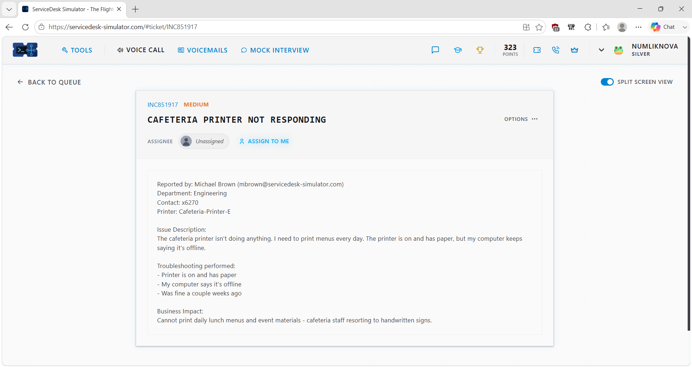
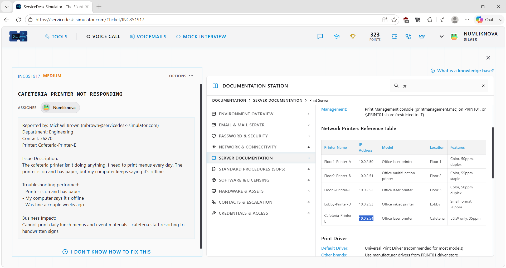
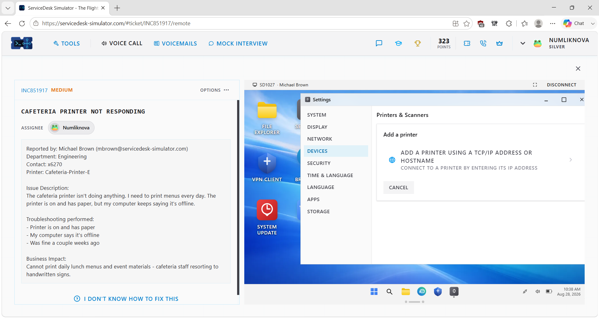
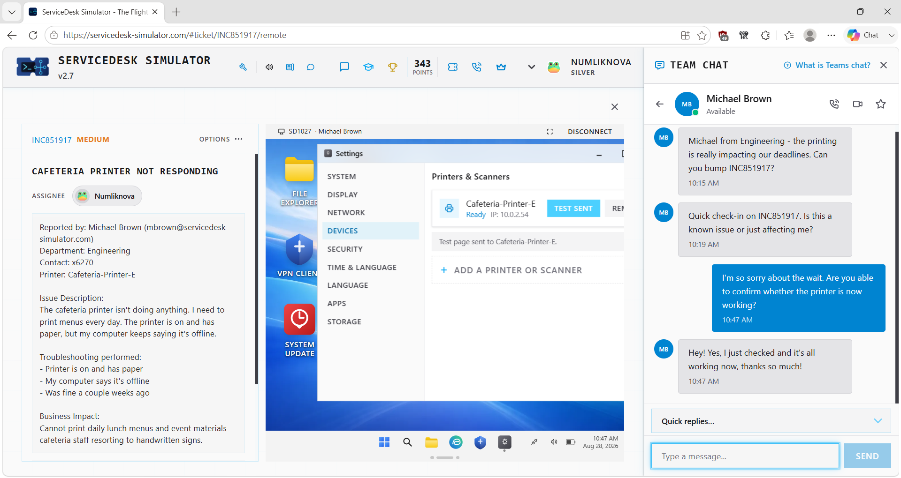
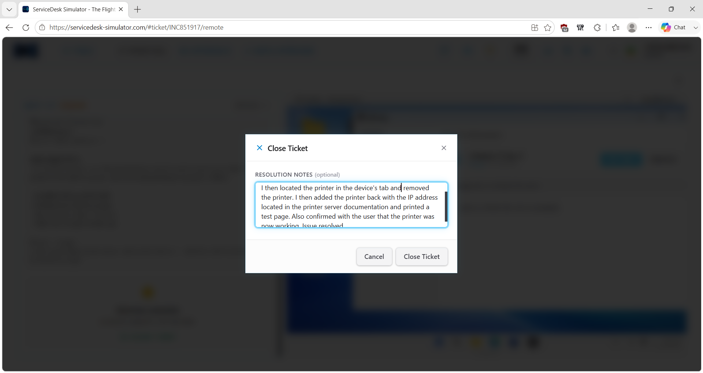

# Service Desk Simulation – Network Printer Not Responding

## Overview

This service desk simulation demonstrates how I troubleshot a network printer that appeared offline on a user's Windows computer even though the physical printer was powered on and had paper.

Rather than assuming the printer itself had failed, I reviewed the organization's printer-server documentation, identified the documented IP address for the correct printer, remotely connected to the user's workstation, reviewed the existing printer configuration, and recreated the printer connection using the verified IP address.

I then printed a test page and confirmed with the user that normal printing functionality had been restored.

> **Note:** This scenario was completed in a service desk simulation for hands-on learning and does not represent professional production experience.

## Ticket Summary

- **Ticket:** Cafeteria Printer Not Responding
- **Ticket ID:** INC851917
- **Priority:** Medium
- **Category:** Printer / Network Printer Support
- **Environment:** Service Desk Simulator / Windows Client
- **Support Method:** Remote Desktop
- **Status:** Resolved

## Scenario

A user reported that the cafeteria network printer was not responding.

The physical printer was powered on and had paper, but Windows reported the printer as offline.

The printer was needed for daily lunch menus and event materials, so the issue was affecting normal cafeteria operations.

Because the physical printer appeared available, I continued troubleshooting the workstation's printer configuration and network connection rather than immediately assuming there was a hardware failure.

## Troubleshooting Process

### 1. Review and Take Ownership of the Ticket

I reviewed the reported issue, troubleshooting already performed by the user, and the business impact before assigning the ticket to myself.

### 2. Review Printer Documentation

Because the issue involved a specific organizational printer, I reviewed the available printer-server documentation before changing the workstation configuration.

The documentation allowed me to identify the cafeteria printer and verify its documented network information instead of guessing at the correct configuration.

### 3. Identify the Printer's Documented IP Address

I located the cafeteria printer in the printer-server documentation and identified its documented IP address.

This provided a known configuration value that I could use when reconnecting the user's workstation to the printer.

### 4. Connect to the User's Workstation

After gathering the required printer information, I used the simulator's Remote Desktop support tool to connect to the affected Windows computer.

I reviewed the existing printer configuration and confirmed that the cafeteria printer was already configured but was reporting an offline status.

### 5. Recreate the Printer Connection

I removed the existing cafeteria printer configuration from the workstation.

I then selected the option to add a printer using an IP address and entered the address I had verified in the printer-server documentation.

This created a fresh connection to the documented network printer.

### 6. Test Printing

After the printer was successfully added to Windows, I printed a test page.

The test page completed successfully, confirming that the workstation could communicate with the configured network printer and send a print job successfully.

### 7. Verify the Resolution With the User

After the successful test page, I contacted the user and asked them to verify that the cafeteria printer was working normally.

The user confirmed that printing functionality had been restored.

### 8. Document the Resolution

After completing technical testing and receiving confirmation from the user, I documented the troubleshooting steps and outcome in the service desk ticket.

## Resolution

The physical printer was powered on and available, while the user's Windows workstation reported the printer as offline.

I reviewed the organization's printer-server documentation, identified the correct documented IP address, removed the existing printer configuration, and re-added the network printer using that IP address.

A test page printed successfully, and the user confirmed that normal printing functionality had been restored.

The simulation demonstrated that recreating the workstation's printer connection resolved the reported issue. The available evidence did not establish exactly why the previous printer configuration had stopped working.

## Troubleshooting Logic

**Network printer reported offline**

→ Check reported physical printer status

→ Printer powered on and has paper

→ Review printer-server documentation

→ Identify documented printer IP address

→ Connect to affected workstation

→ Review existing printer configuration

→ Remove existing printer

→ Re-add printer using verified IP

→ Print test page

→ Confirm with user

→ Document resolution

## Technical Concepts Practiced

### Network Printers

A network printer communicates with computers through a network connection rather than requiring a direct USB connection to each workstation.

### IP Addressing

An IP address identifies a device on an IP network.

In this simulation, the documented printer IP address was used to establish the workstation's connection to the correct network printer.

### Printer Configuration

A physical printer can be powered on while a workstation still has a problem with its configured printer connection.

This makes it important to distinguish between the status of the physical device and the printer configuration on the user's computer.

### Technical Documentation

Internal technical documentation can provide known configuration information such as printer names and network addresses.

Using documented information reduced the risk of connecting the workstation to an incorrect printer or using an unverified address.

### Test-Page Verification

Printing a test page provided technical verification that Windows could successfully communicate with the configured printer and send a print job.

### User Verification

A successful technical test is important, but confirming the result with the user provides an additional check that the original business problem has been resolved.

## Skills Demonstrated

- Service desk ticket ownership
- Network printer troubleshooting
- Windows printer configuration
- IP-based printer connections
- Remote desktop support
- Windows device management
- Technical documentation usage
- Offline printer troubleshooting
- Printer removal and reconfiguration
- Test-page verification
- User communication
- Resolution verification
- Ticket documentation

## Key Takeaway

This scenario reinforced that an **offline printer does not automatically mean the physical printer is broken**.

The printer was powered on and had paper, so I continued investigating the connection between the user's workstation and the network printer.

By verifying the printer's documented network information, recreating the printer connection, testing with a print job, and confirming the result with the user, I was able to work through the issue systematically.

**Check physical status → Verify documentation → Review configuration → Reconnect → Test → Confirm → Document**
