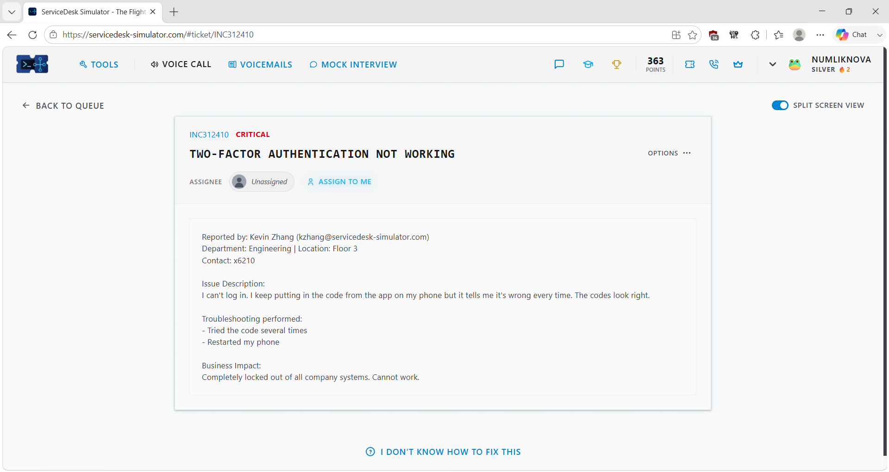
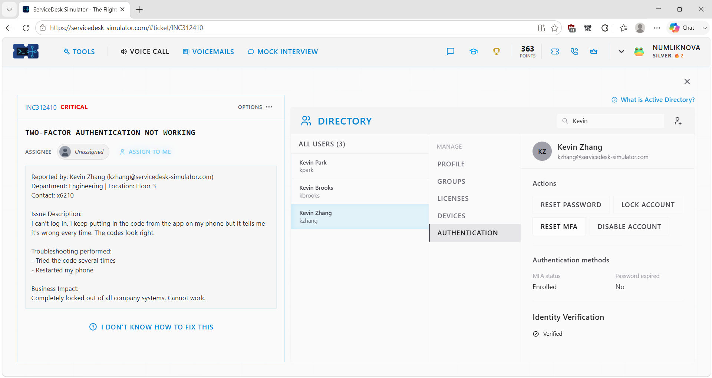
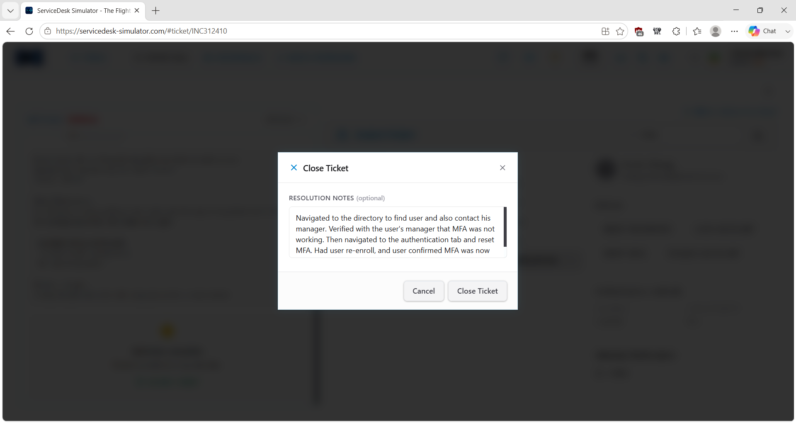

# Service Desk Simulation – MFA Authentication Issue

## Overview

This service desk simulation demonstrates how I handled a security-sensitive authentication issue for a user who could not complete multi-factor authentication (MFA) and was unable to access required company resources.

Rather than immediately resetting the user's MFA configuration, I first verified the affected account and confirmed authorization with the user's manager. After receiving approval, I reset the user's MFA configuration, instructed the user to re-enroll, and verified that authentication was working again.

> **Note:** This scenario was completed in a service desk simulation for hands-on learning and does not represent professional production experience.

## Ticket Summary

- **Ticket ID:** INC312410
- **Priority:** Critical
- **Category:** Identity & Access Management / Authentication
- **Environment:** Service Desk Simulator
- **Status:** Resolved

## Scenario

A user reported that two-factor authentication was not working and they were unable to complete the authentication process.

Because resetting MFA affects a user's authentication configuration, I treated the request as a security-sensitive access issue rather than making the change immediately.

## Troubleshooting & Resolution Process

### 1. Review and Assign the Ticket

I reviewed the ticket details, priority, reported authentication problem, and impact before assigning the incident to myself.

### 2. Locate and Verify the User

I navigated to the employee directory and located the affected user's account.

Before making any authentication changes, I verified that I was working with the correct identity.

### 3. Confirm Authorization

Because the request involved resetting a security-related authentication method, I contacted the user's manager through the simulator's communication tools and confirmed that the MFA reset was authorized.

This provided an additional verification step before modifying the user's authentication configuration.

### 4. Reset the MFA Configuration

After authorization was confirmed, I opened the user's Authentication settings and performed the MFA reset.

### 5. Have the User Re-Enroll and Verify Access

After the reset, the user needed to enroll their authentication method again.

I communicated the next steps and confirmed that the user was able to complete re-enrollment and authenticate successfully.

### 6. Document the Resolution

After confirming that authentication was working again, I documented the actions performed and the successful outcome in the ticket.

## Resolution

The user's MFA configuration was reset after the account and authorization were verified.

The user then completed MFA re-enrollment and confirmed that authentication was working successfully.

The incident was documented and resolved.

## Troubleshooting Logic

**User cannot complete MFA**

→ Identify affected user

→ Verify correct account

→ Confirm authorization before security-sensitive change

→ Reset MFA configuration

→ User re-enrolls authentication method

→ Verify successful authentication

→ Document resolution

## Technical Concepts Practiced

### Multi-Factor Authentication

MFA strengthens authentication by requiring an additional verification factor beyond a password.

When an MFA method becomes unusable or needs to be reset, support personnel must ensure that the request is legitimate before modifying the user's authentication configuration.

### Identity Verification and Authorization

Authentication resets can affect access to organizational resources.

This scenario reinforced the importance of verifying the correct identity and confirming authorization before performing a security-sensitive change.

### MFA Re-Enrollment

Resetting an authentication configuration may require the user to register their authentication method again.

The support process is not complete until the user understands the next steps and successful authentication is verified.

### Verification Before Closure

Performing the administrative change alone does not prove that the user's problem is resolved.

The user confirmed that re-enrollment and authentication were successful before the ticket was considered complete.

## Skills Demonstrated

- Service desk ticket ownership
- MFA troubleshooting
- Identity and authentication support
- User account verification
- Authorization verification
- Security-sensitive access support
- MFA reset
- Authentication re-enrollment
- User communication
- Resolution verification
- Identity and Access Management fundamentals
- Technical documentation

## Key Takeaway

This scenario reinforced that authentication-related changes should be handled carefully.

**Verify the identity → Confirm authorization → Make the change → Re-enroll → Verify access**

The goal is not simply to reset MFA, but to make sure the change is authorized and that the user can successfully authenticate afterward.
