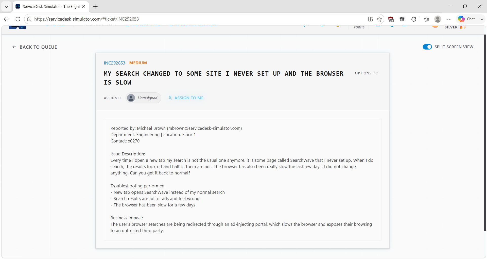
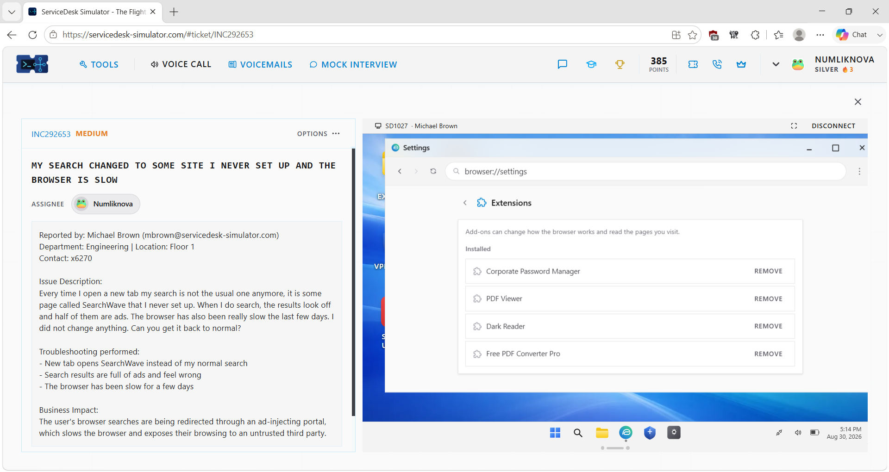
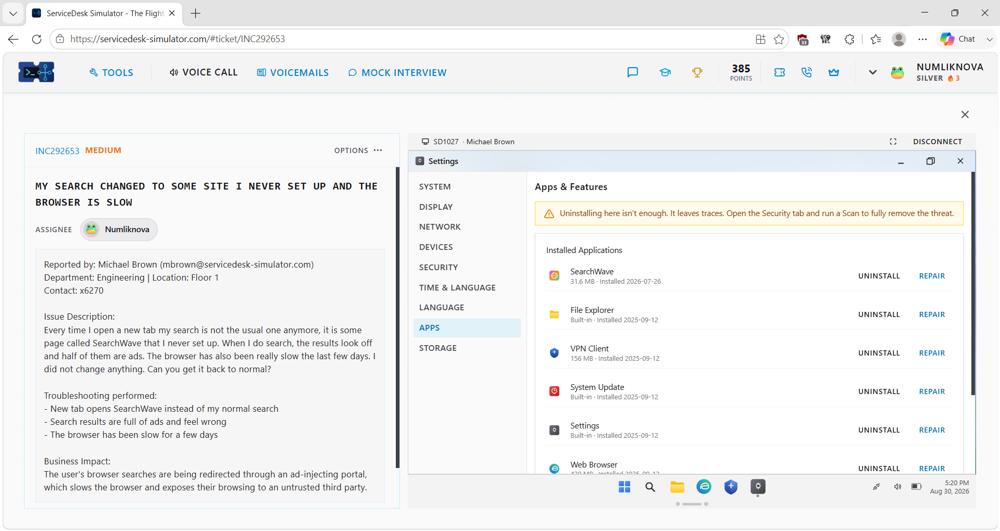
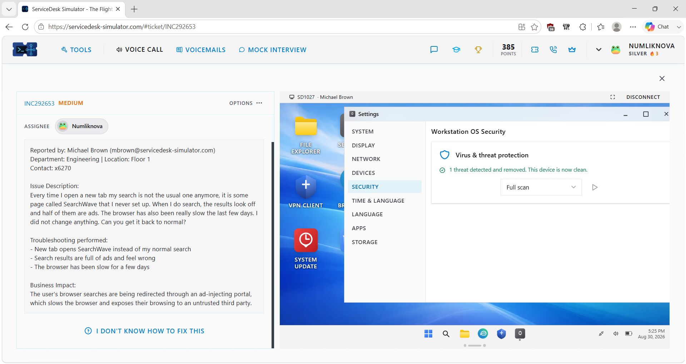
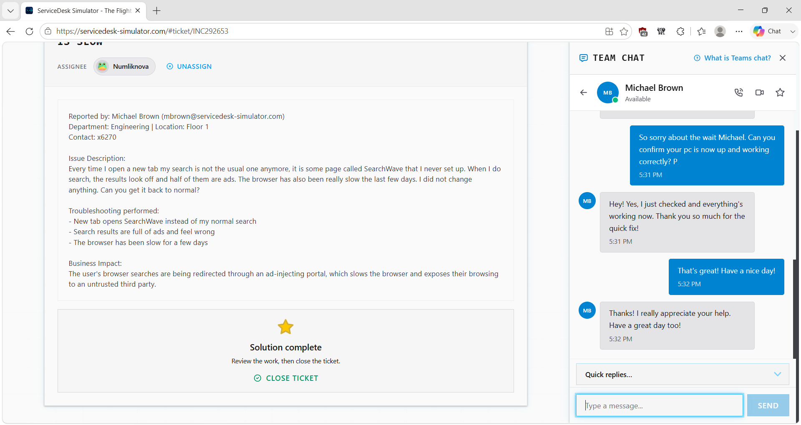
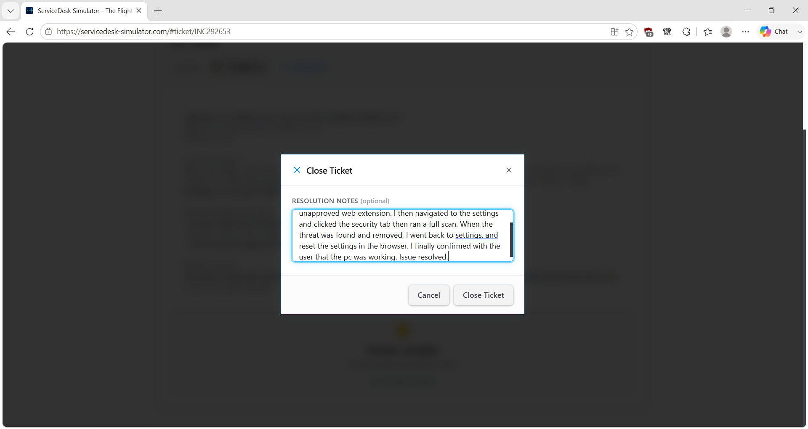

# Service Desk Simulation – Browser Redirect & Performance Issue

## Overview

This service desk simulation demonstrates how I investigated a browser that unexpectedly began redirecting searches through an unfamiliar search provider, displaying excessive advertisements, and experiencing degraded performance.

Rather than only changing the user's search engine back to its previous setting, I investigated why the browser behavior had changed. I compared installed browser extensions against company documentation, removed an unapproved extension, found and uninstalled a recently installed SearchWave application, ran a security scan, remediated an additional detected threat, reset the browser configuration, and verified the resolution with the user.

> **Note:** This scenario was completed in a service desk simulation for hands-on learning and does not represent professional production experience.

## Ticket Summary

- **Ticket ID:** INC292653
- **Priority:** Medium
- **Category:** Endpoint Support / Browser Security
- **Environment:** Service Desk Simulator / Windows Client
- **Support Method:** Remote Desktop
- **Status:** Resolved

## Scenario

The user reported that opening a new browser tab displayed **SearchWave** instead of their normal search provider.

Search results contained numerous advertisements, and the browser had become noticeably slower over the previous several days.

The user stated that they had not intentionally changed the browser configuration.

Because the issue involved an unexpected redirect, unfamiliar software, advertisements, and reduced performance, I investigated for unwanted software or other changes rather than treating the issue only as a browser preference problem.

## Troubleshooting Process

### 1. Review and Take Ownership of the Ticket

I reviewed the reported symptoms, troubleshooting information, and business impact before assigning the ticket to myself.

The combination of an unexpected search provider, excessive advertisements, and degraded performance indicated that further investigation was needed.

### 2. Connect to the User's Workstation

Because the problem was occurring directly on the user's computer, I used the simulator's Remote Desktop support tool to connect to the workstation.

This allowed me to inspect the browser configuration, extensions, installed applications, and security settings.

### 3. Establish an Approved-Software Baseline

Before removing anything from the workstation, I reviewed the company's documentation for approved browser extensions.

I then compared that information against the extensions currently installed in the user's browser.

Using documentation as a baseline helped distinguish approved software from components that required further investigation.

### 4. Identify and Remove an Unapproved Browser Extension

During the extension review, I found an extension that did not appear on the organization's approved-extension list.

Based on the user's symptoms and the documentation comparison, I removed the unapproved extension.

### 5. Continue Investigating Installed Applications

I did not assume that removing the browser extension alone had resolved the underlying problem.

I reviewed the applications installed on the workstation and looked for recently installed or unfamiliar software that could be related to the reported browser behavior.

### 6. Identify and Uninstall SearchWave

During the application review, I found a recently installed **SearchWave** application associated with the same unfamiliar search service appearing in the user's browser.

I uninstalled the SearchWave application from the workstation.

### 7. Run a Security Scan

Because the workstation contained an unapproved browser extension and unwanted software, I performed an additional security check rather than assuming the system was clean.

The simulator's security scan detected another threat.

I followed the simulator's remediation process to remove the detected threat and verified that the device reported a clean status afterward.

### 8. Reset the Browser Configuration

After removing the unapproved extension, uninstalling SearchWave, and remediating the detected threat, I reset the browser settings.

This helped restore browser configuration that may have been modified during the incident, including search-related behavior.

### 9. Verify the Resolution With the User

After completing the remediation steps, I contacted the user and asked them to test the computer and browser again.

The user confirmed that normal browser functionality and performance had been restored.

### 10. Document the Resolution

After verifying the fix with the user, I documented the investigation, remediation steps, and final outcome in the service desk ticket.

## Resolution

The browser redirect and performance problems were associated with unwanted changes and software on the workstation.

During the investigation, I identified and removed an unapproved browser extension and a recently installed SearchWave application. A subsequent security scan detected an additional threat, which I remediated using the simulator's security tools.

I then reset the browser configuration and confirmed with the user that normal browser functionality and performance had been restored.

## Troubleshooting Logic

**Unexpected browser redirect and poor performance**

→ Review reported symptoms

→ Connect to affected workstation

→ Establish approved-software baseline

→ Review browser extensions

→ Identify unapproved extension

→ Remove extension

→ Continue investigating installed applications

→ Find and uninstall SearchWave

→ Run security scan

→ Remediate detected threat

→ Reset browser configuration

→ Test functionality

→ Confirm with user

→ Document resolution

## Technical Concepts Practiced

### Browser Redirects

An unexpected browser redirect occurs when searches or webpages are sent through a different site or search provider without the user's intended configuration.

Unexpected redirects should be investigated rather than automatically treated as a simple browser preference change.

### Browser Extensions

Browser extensions add or modify browser functionality.

In an organizational environment, installed extensions may need to be compared against approved-software policies or documentation before being trusted.

### Potentially Unwanted Software

Software can alter browser behavior, introduce advertisements, change settings, or perform actions the user did not intentionally request.

Finding unfamiliar software associated with the reported symptoms can provide an important troubleshooting clue.

### Security Scanning

A security scan can provide an additional check when suspicious or unauthorized software is discovered on a workstation.

In this simulation, the scan detected an additional threat after the browser extension and SearchWave application were removed.

### Remediation

Remediation involves actions taken to address a detected security issue.

The exact response in a real organization would depend on established security procedures and the technician's level of authorization.

A confirmed malware or security incident may require escalation to an organization's security team rather than independent remediation by the service desk.

### Root-Cause-Oriented Troubleshooting

Changing the default search engine may have temporarily removed the visible symptom without addressing the reason the browser configuration changed.

Continuing the investigation helped uncover additional unwanted components on the workstation.

## Skills Demonstrated

- Service desk ticket ownership
- Remote desktop support
- Browser troubleshooting
- Browser extension management
- Approved-software verification
- Windows application management
- Unwanted software investigation
- Endpoint security fundamentals
- Security scanning
- Threat remediation in a simulated environment
- Browser configuration and reset
- Technical documentation usage
- Root-cause-oriented troubleshooting
- User communication
- Resolution verification
- Ticket documentation

## Key Takeaway

This scenario reinforced an important troubleshooting principle:

**Do not only fix the visible symptom — investigate why the symptom occurred.**

Simply changing the user's search provider could have left the unwanted extension, SearchWave application, and detected threat on the workstation.

By continuing the investigation, I was able to address the additional findings before restoring the browser configuration and verifying normal operation with the user.

**Investigate → Compare → Remove → Scan → Remediate → Restore → Verify → Document**
