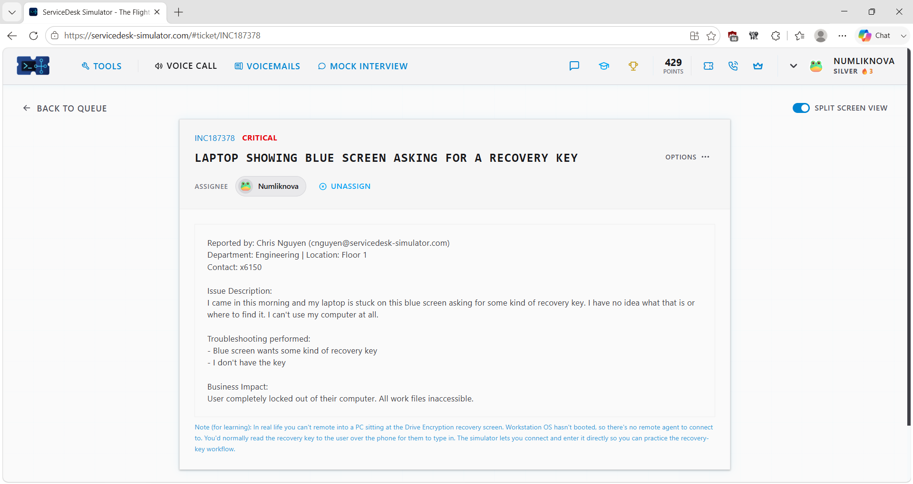
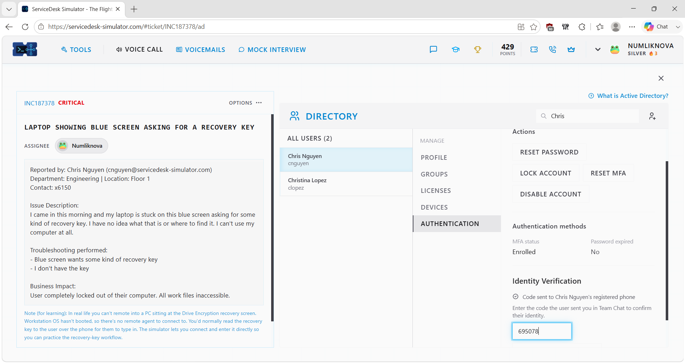
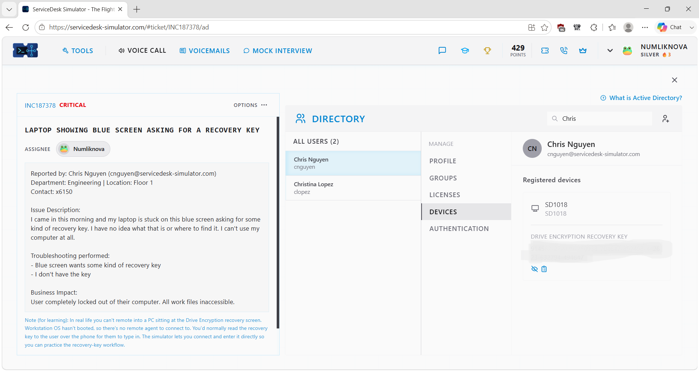
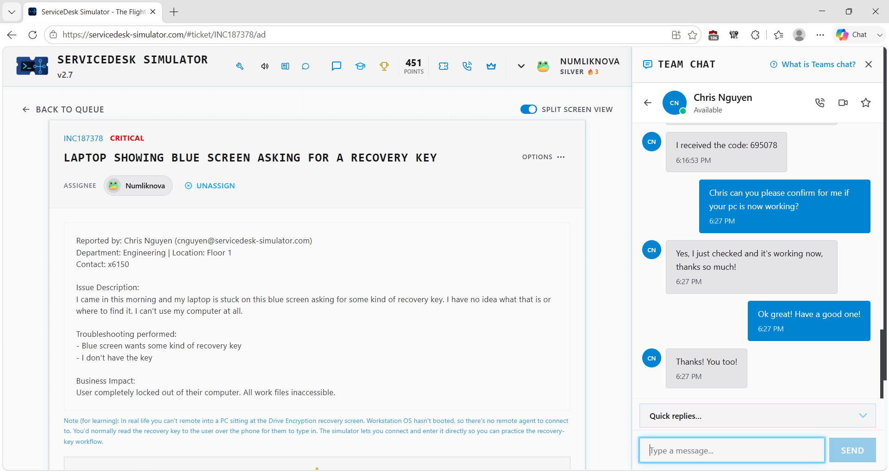
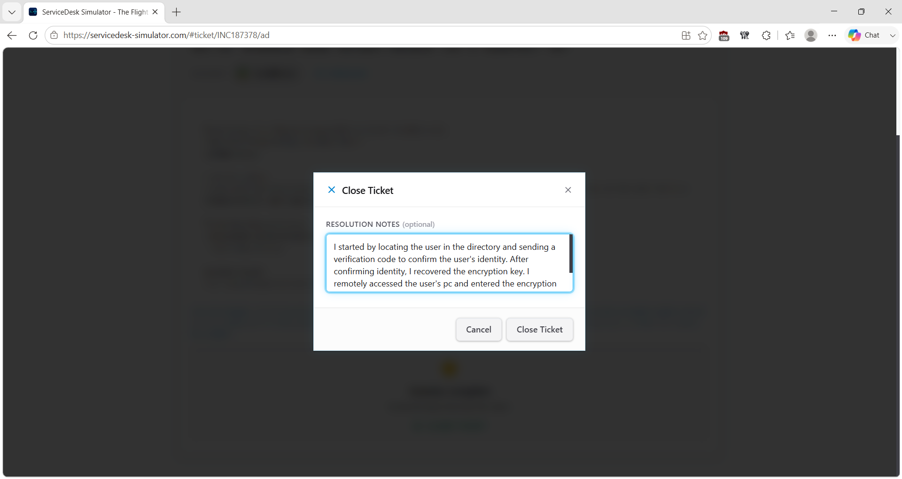

# Service Desk Simulation – BitLocker Recovery & Laptop Lockout

## Overview

This service desk simulation demonstrates how I handled a security-sensitive endpoint recovery issue involving a company laptop that stopped at a drive-encryption recovery screen before Windows could start.

The user did not have the required recovery key and was unable to access the computer. Because a recovery key can unlock an encrypted device, I completed the simulator's identity-verification process before retrieving the recovery information.

After verification, I retrieved the appropriate recovery key, completed the simulator's recovery workflow, verified that the laptop started successfully, and confirmed with the user that normal access had been restored.

> **Note:** This scenario was completed in a service desk simulation for hands-on learning and does not represent professional production experience.

## Ticket Summary

- **Ticket ID:** INC187378
- **Priority:** Critical
- **Category:** Endpoint Support / Security / Drive Encryption
- **Environment:** Service Desk Simulator / Windows Client
- **Status:** Resolved

## Scenario

A user reported arriving at work and finding their company laptop at a blue drive-encryption recovery screen requesting a recovery key.

The user did not know the recovery key and could not access Windows or the work files stored on the device.

Because the computer could not complete startup and the user was unable to work, the simulator classified the incident as Critical.

## Troubleshooting & Recovery Process

### 1. Review and Take Ownership of the Ticket

I reviewed the reported issue, troubleshooting information, priority, and business impact before assigning the ticket to myself.

### 2. Locate and Verify the Correct User

Before accessing any recovery information, I located the affected employee's account in the directory.

I confirmed that I was working with the identity associated with the affected device before continuing with the security-sensitive recovery process.

### 3. Complete Identity Verification

Rather than immediately retrieving the recovery key, I followed the simulator's identity-verification process.

A verification code was sent to the user. After the user supplied the code, I entered it into the system and completed the verification process.

### 4. Retrieve the Recovery Key

After the user's identity was verified, I opened the account's Authentication section and retrieved the appropriate drive-encryption recovery key.

Because a recovery key can unlock an encrypted device, I treated it as sensitive security information and accessed it only after completing verification.

> **Security note:** The recovery-key value shown during this lab should be redacted from any screenshot published in this public portfolio.

### 5. Complete the Recovery Workflow

I used the recovery key through the simulator's drive-recovery workflow.

The key was accepted, allowing the encrypted drive to unlock and the laptop to continue startup.

### Important Real-World Difference

The simulator allows interaction with the computer while it is at the pre-boot recovery screen so the recovery process can be practiced.

A normal Windows remote-support session would not typically be available at this point because Windows has not fully started.

In a real organization, I would follow the company's approved recovery procedure. Depending on the environment, that could involve securely providing recovery information to a verified user or using another authorized device-recovery process.

The remote pre-boot interaction in this scenario should therefore be understood as a **simulator training mechanism**, not normal Windows remote-support behavior.

### 6. Verify the Recovery With the User

After the laptop successfully started, I contacted the user and verified that normal computer access had been restored.

The user confirmed that the PC was working.

### 7. Document the Resolution

After verifying successful recovery, I documented the identity verification, recovery procedure, and outcome in the service desk ticket.

## Resolution

The laptop had entered drive-encryption recovery mode and required a recovery key before Windows could start.

I completed the required identity-verification process before accessing the recovery information, retrieved the appropriate recovery key, completed the simulator's recovery workflow, and confirmed with the user that normal laptop access had been restored.

## Troubleshooting Logic

**Laptop stopped at recovery screen**

→ Identify the type of screen

→ Locate the correct user/account

→ Complete identity verification

→ Retrieve authorized recovery information

→ Complete device recovery

→ Verify laptop starts normally

→ Confirm with user

→ Document resolution

## Technical Concepts Practiced

### Drive Encryption

Full-disk encryption helps protect information stored on a device by preventing unauthorized access to encrypted data.

### BitLocker Recovery

BitLocker is Microsoft's full-volume encryption technology for Windows devices.

A recovery key can be used to unlock an encrypted volume when the normal unlock process cannot be completed.

Because of that capability, recovery keys should be protected according to organizational security procedures.

### Identity Verification

Knowing that a recovery key is required does not mean the key should immediately be accessed or provided.

This scenario reinforced the importance of verifying the user before retrieving security-sensitive recovery information.

### Pre-Boot Recovery

A drive-encryption recovery prompt can occur before Windows fully starts.

That distinction matters because troubleshooting tools that depend on a running Windows session may not yet be available.

### Recovery Screen vs. BSOD

A user describing a computer as being on a "blue screen" does not automatically mean the computer experienced a Blue Screen of Death.

A Windows crash and a drive-encryption recovery prompt require different troubleshooting paths.

**BSOD → Investigate operating system or system failure**

**Recovery-key screen → Follow approved drive-encryption recovery procedure**

## Skills Demonstrated

- Service desk ticket ownership
- Endpoint support
- BitLocker and drive-encryption fundamentals
- Identity verification
- Recovery-key procedures
- Security-sensitive information handling
- Windows recovery troubleshooting
- User communication
- Resolution verification
- Security-conscious troubleshooting
- Technical documentation

## Key Takeaway

This scenario reinforced that security verification is part of the troubleshooting process.

Even when the technical resolution appears obvious, sensitive recovery information should not be accessed or provided without following the required verification process.

**Verify identity → Retrieve authorized recovery information → Recover device → Verify access**
