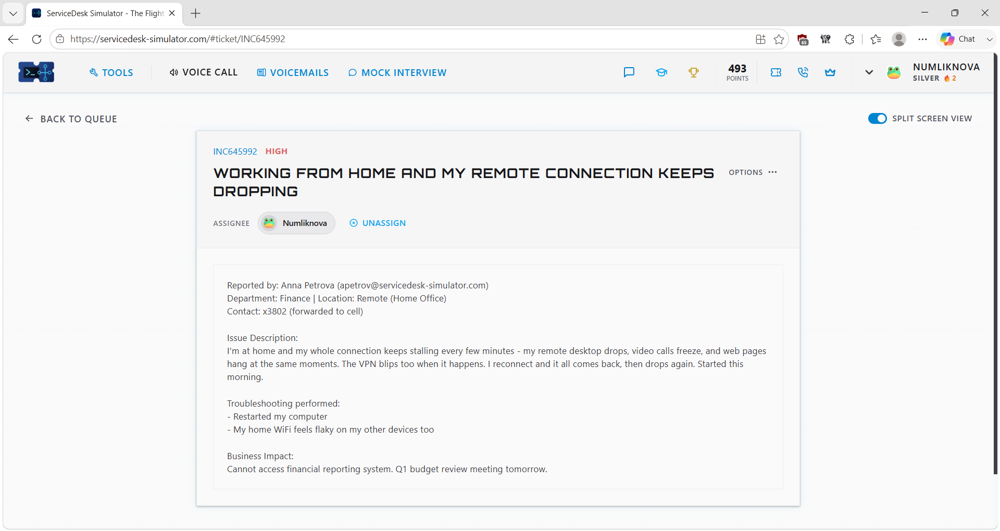
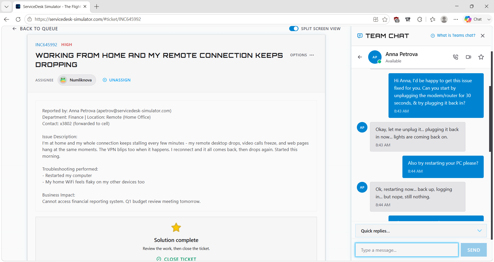
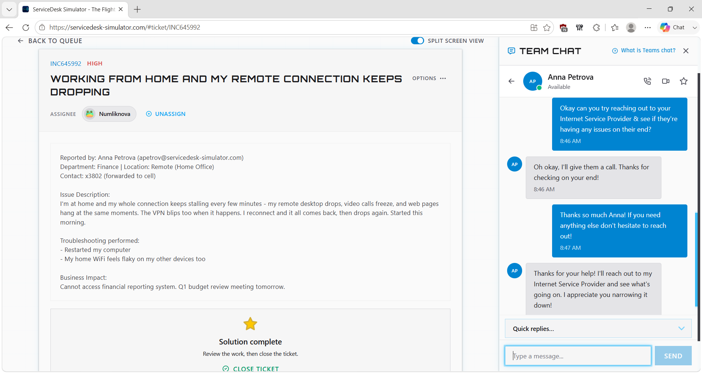
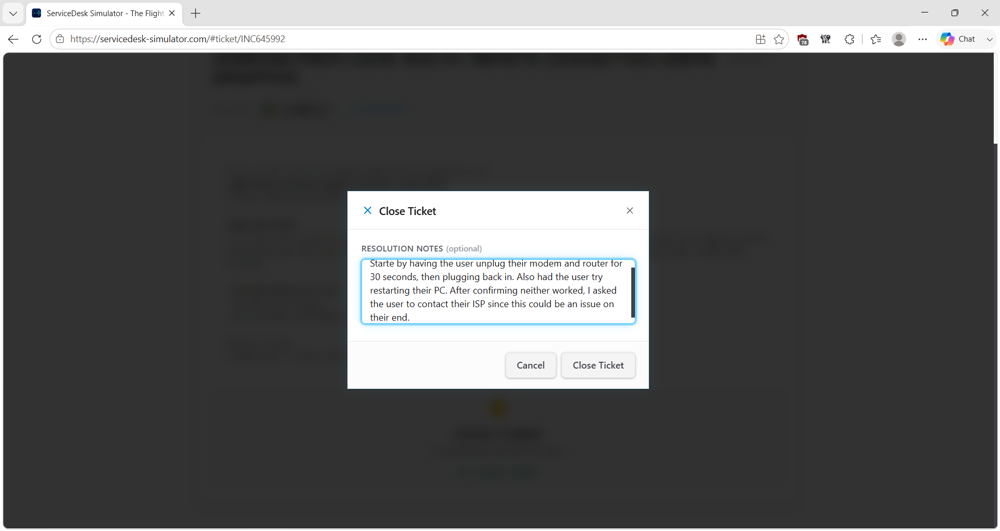

# Service Desk Simulation – Intermittent VPN & Remote Connectivity Troubleshooting

## Overview

This service desk simulation demonstrates how I troubleshot an intermittent connectivity issue affecting a remote Finance employee.

The user initially reported that their VPN and Remote Desktop connection kept dropping. After gathering additional information, I learned that video calls, web browsing, and other devices connected to the user's home Wi-Fi were also experiencing problems.

Instead of assuming the corporate VPN was the cause, I used the broader symptoms to narrow the issue toward the user's underlying home network or Internet Service Provider (ISP).

> **Note:** This scenario was completed in a service desk simulation for hands-on learning and does not represent professional production experience.

## Ticket Summary

- **Ticket ID:** INC645992
- **Priority:** High
- **Category:** Network / VPN / Remote Access
- **Environment:** Service Desk Simulator / Remote User
- **Status:** Resolved

## Scenario

A Finance employee working from home reported that their remote connection repeatedly stalled or disconnected.

The issue affected:

- Corporate VPN
- Remote Desktop
- Video calls
- Web browsing
- Other devices connected to the user's home Wi-Fi

The user had already restarted their computer, but the problem continued.

Because several services and multiple devices were affected at the same time, I investigated the underlying network connection rather than focusing only on the VPN.

## Troubleshooting Process

### 1. Review the Ticket and Business Impact

I reviewed the reported symptoms, troubleshooting already performed, priority, and business impact before beginning the investigation.

The connectivity problem was preventing the user from reliably accessing an important Finance system.

### 2. Determine the Scope of the Problem

I contacted the user to gather additional information.

The user reported that the problem was not limited to the corporate VPN. Remote Desktop, video calls, web browsing, and other devices on the home Wi-Fi were also experiencing connectivity issues.

This indicated that the VPN disconnects could be a symptom of a broader connectivity problem.

As an initial troubleshooting step, I had the user restart their home modem/router.

### 3. Continue Basic Troubleshooting

I also had the user restart the workstation to eliminate a temporary computer or network-adapter issue.

The connection remained unstable after the basic troubleshooting steps.

### 4. Identify the Likely Troubleshooting Boundary

Because multiple network-dependent services and multiple devices were affected, the symptoms pointed toward the user's home network or ISP rather than an isolated corporate VPN issue.

The corporate service desk could troubleshoot the user's workstation and remote-access symptoms, but further diagnostics of the residential internet connection required the user's Internet Service Provider.

I advised the user to contact their ISP for additional troubleshooting.

### 5. Document the Findings

I documented the symptoms, troubleshooting performed, findings, and recommended next steps in the service desk ticket.

## Resolution

The troubleshooting did not indicate an isolated corporate VPN problem.

The VPN, Remote Desktop session, video calls, web browsing, and other devices on the user's home Wi-Fi were affected at the same time.

After basic troubleshooting did not resolve the instability, the symptoms pointed toward the user's home network or ISP as the likely source. The user was advised to contact their ISP for further investigation.

## Troubleshooting Logic

**Remote connection keeps dropping**

→ Determine which services are affected

→ VPN, RDP, video calls, and web browsing are affected

→ Check whether other devices are affected

→ Other home Wi-Fi devices also have problems

→ Identify the common dependency

→ Restart modem/router

→ Restart workstation

→ Connectivity remains unstable

→ Issue likely exists outside an isolated corporate VPN problem

→ Refer user to ISP

→ Document findings

## Technical Concepts Practiced

### VPN Troubleshooting

A VPN depends on a functioning underlying internet connection.

If the user's internet connection becomes unstable, the VPN may also disconnect even when the VPN service itself is functioning normally.

### Problem Isolation

The user initially described the issue as a VPN and remote-access problem.

By gathering more information, I found that the symptoms extended beyond corporate services.

This changed the troubleshooting direction from:

**“Why is the VPN failing?”**

to:

**“What common dependency could affect all of these services and devices?”**

### Multiple-Device Troubleshooting

Checking whether another device experiences the same problem can help determine the scope of a network issue.

In this scenario:

**One computer affected**  
→ Could indicate a workstation-specific problem

**Multiple devices affected**  
→ Suggests investigating the shared network connection or upstream service

### Support Boundaries and Escalation

A service desk may be able to troubleshoot a remote workstation and corporate services but may not be able to directly repair a user's residential internet connection.

Recognizing when an issue should be referred to the appropriate external provider is part of effective troubleshooting.

## Skills Demonstrated

- Service desk ticket ownership
- Remote user support
- Network troubleshooting
- VPN troubleshooting
- Remote-access troubleshooting
- Problem isolation
- Scope determination
- Multiple-device troubleshooting
- Home network troubleshooting
- ISP escalation
- User communication
- Business-impact assessment
- Technical documentation

## Key Takeaway

This scenario reinforced an important troubleshooting principle:

**When several services fail at the same time, look for the common dependency instead of assuming the first reported service is the root cause.**

The VPN disconnect was one symptom among several. Identifying that multiple services and devices were affected helped narrow the issue toward the user's underlying home network or ISP.
