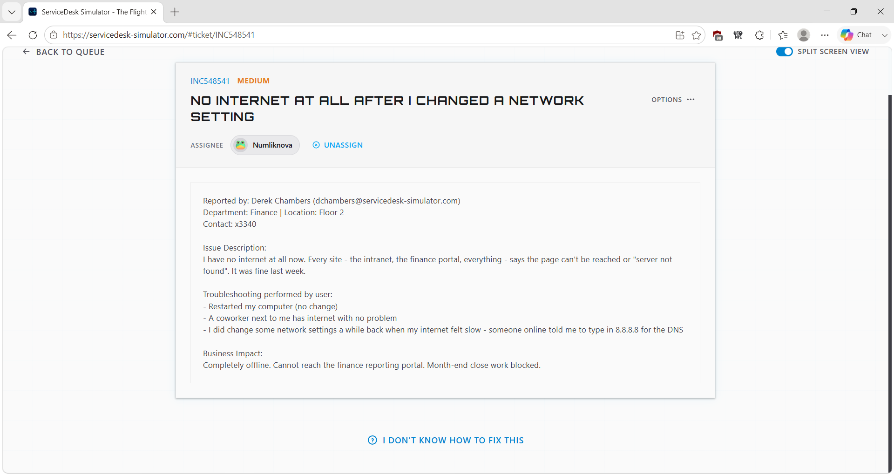
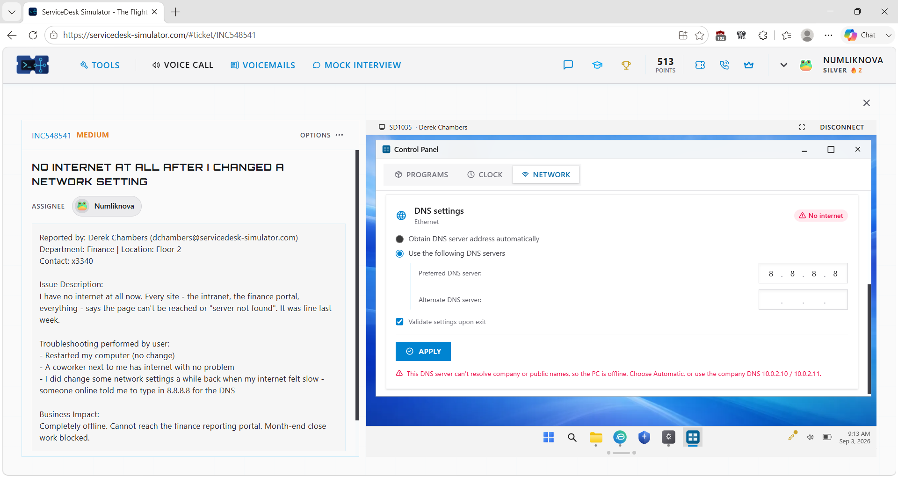
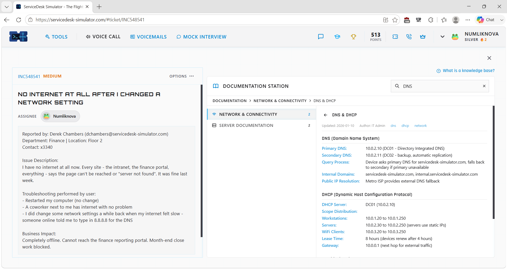
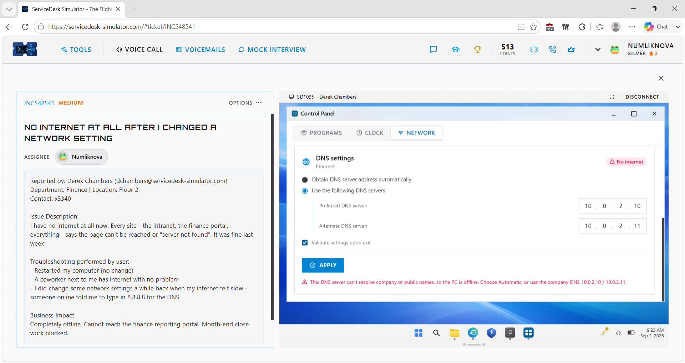
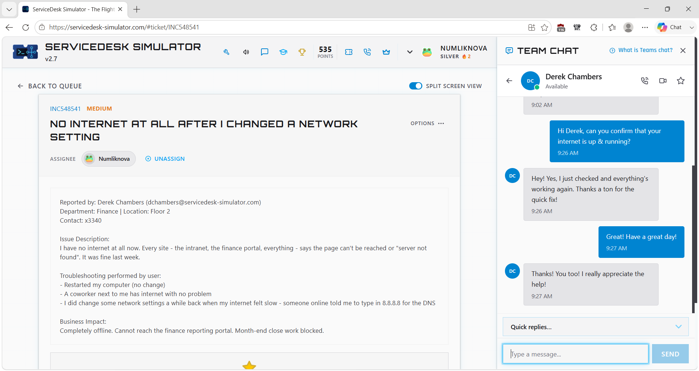
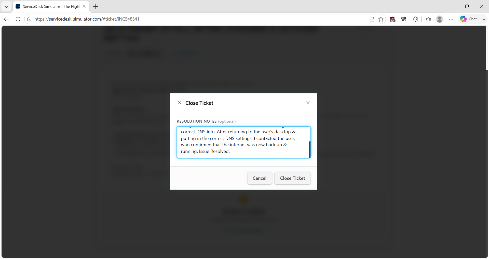

# Service Desk Simulation – DNS Misconfiguration & Network Connectivity Failure

## Overview

This service desk simulation demonstrates how I troubleshot a Windows workstation that could no longer access websites, the company intranet, or a Finance reporting portal after the user manually changed a network setting.

The user had configured `8.8.8.8` as the workstation's DNS server. I first determined the scope of the issue, reviewed the recent configuration change, inspected the workstation's DNS settings, checked the organization's documented network configuration, corrected the DNS settings, and verified that connectivity was restored.

> **Note:** This scenario was completed in a service desk simulation for hands-on learning and does not represent professional production experience.

## Ticket Summary

- **Ticket ID:** INC548541
- **Priority:** Medium
- **Category:** Network / DNS / Connectivity
- **Environment:** Service Desk Simulator / Windows Client
- **Status:** Resolved

## Scenario

A Finance employee reported that their computer could no longer access network resources.

Important troubleshooting clues included:

- A nearby coworker still had working network connectivity.
- The affected user had recently changed their DNS server to `8.8.8.8`.
- Restarting the workstation had not resolved the problem.

Because another user nearby was unaffected, I focused troubleshooting on the affected workstation rather than treating the issue as a company-wide outage.

## Troubleshooting Process

### 1. Determine the Scope

I reviewed the ticket and identified that the issue affected one workstation while a nearby coworker still had network access.

This suggested that the problem was likely related to the affected computer's local configuration.

### 2. Inspect the DNS Configuration

I remotely accessed the user's workstation and reviewed its network settings.

The Preferred DNS server was manually configured as:

`8.8.8.8`

This matched the recent network change reported by the user and became the primary suspected cause.

### 3. Review Approved Company Configuration

Rather than guessing which DNS servers should be used, I reviewed the organization's internal Network & Connectivity documentation.

The documentation provided the approved Primary and Secondary DNS server addresses for company workstations.

### 4. Correct the Workstation's DNS Settings

I replaced the manually configured public DNS server with the organization's documented Preferred and Alternate DNS server addresses and applied the changes.

This returned the workstation to the approved network configuration.

### 5. Verify Connectivity

After correcting the DNS configuration, I contacted the user and asked them to test their connection.

The user confirmed that internet access and the required network resources were working again.

### 6. Document the Resolution

After verifying the result, I documented the issue, corrective action, and successful outcome in the service desk ticket.

## Resolution

The workstation's DNS configuration had been manually changed to a public DNS server that did not match the organization's documented network configuration.

I located the approved DNS settings in company documentation, configured the workstation with those values, and confirmed with the user that network access was restored.

## Troubleshooting Logic

**No network access**

→ Determine scope

→ Coworker still has connectivity

→ Focus on affected workstation

→ Review recent configuration change

→ Inspect DNS settings

→ Identify manually configured `8.8.8.8`

→ Check company documentation

→ Restore approved DNS configuration

→ Verify connectivity

→ Document resolution

## Technical Concepts Practiced

### DNS Troubleshooting

DNS allows systems to resolve names into IP addresses.

An incorrect DNS configuration can prevent a workstation from resolving resources by name even when other parts of the network connection are functioning.

### Public vs. Internal DNS

`8.8.8.8` is a public DNS resolver.

The issue in this simulation was not simply that `8.8.8.8` is a public DNS server. The workstation had been manually configured with a DNS server that did not match the organization's documented DNS configuration.

Corporate environments may require approved internal DNS servers so users can resolve both internal company resources and external services correctly.

### Scope Isolation

The nearby coworker's working connection was an important troubleshooting clue.

**Coworker works → broader network likely operational → one workstation affected → inspect local configuration**

### Recent Changes

The user had changed a network setting shortly before the problem occurred.

Reviewing recent changes helped narrow the investigation and led directly to the incorrect DNS configuration.

### Documentation

Instead of guessing the correct DNS values, I used the organization's documented network configuration.

This reinforced the importance of following approved settings when troubleshooting enterprise systems.

## Skills Demonstrated

- Service desk ticket ownership
- Windows network troubleshooting
- DNS troubleshooting
- TCP/IP fundamentals
- Preferred and Alternate DNS configuration
- Scope determination
- Problem isolation
- Recent-change analysis
- Remote user support
- Internal documentation usage
- Root-cause troubleshooting
- User communication
- Resolution verification
- Technical documentation

## Key Takeaway

This scenario reinforced an important troubleshooting principle:

**When one user is affected, identify what is different about that user's system before assuming there is a larger outage.**

The combination of a working nearby workstation and a recent manual DNS change helped narrow the issue quickly.
